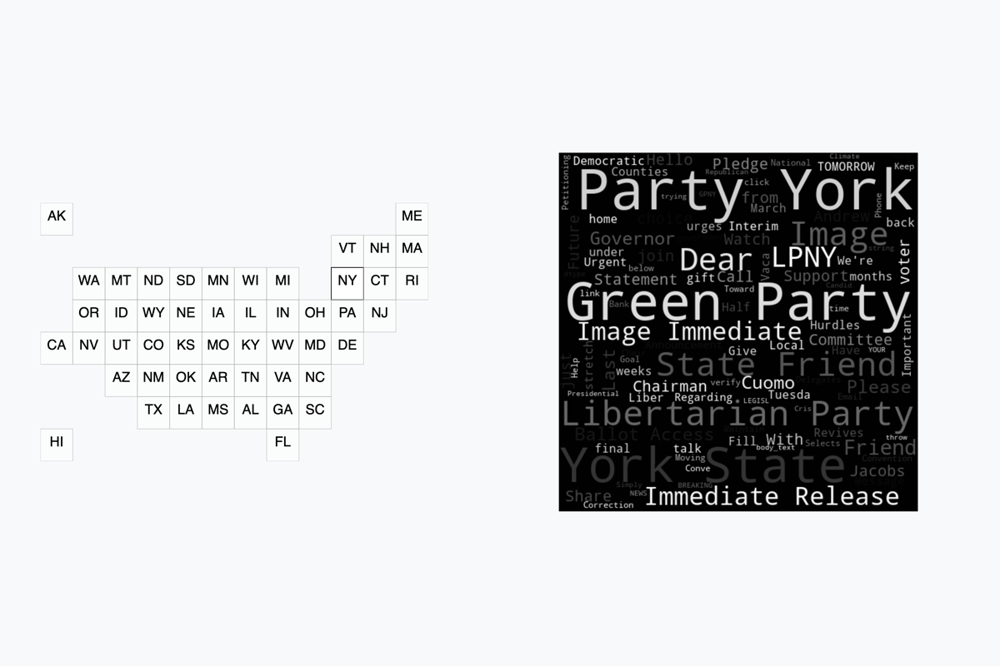

# Princeton Corpus of Political Emails

Emails from candidates running for state and federal office, political parties, and other political organizations like PACs. Dataset contains ~ 400k emails from ~ 3k senders.

[Read blog post](https://fourtonfish.com/blog/exploring-the-princeton-corpus-of-political-emails-dataset/)

## Scripts for exploring the dataset

To obtain the dataset, please see the Dataset section below. Note that the [wordcloud](https://pypi.org/project/wordcloud/) library can be a bit tricky to install, see the library's documentation for instructions for your specific platform.

- `data.py`: general data exploration
- `data-wordcloud.py`: genereate word clouds from emails grouped by state

## Dataset

- [electionemails2020.org](https://electionemails2020.org)
